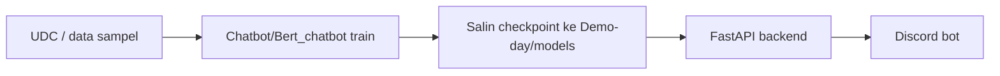

# Demo-day — Chatbot NLP → FastAPI → Discord

**Mata kuliah:** Pemrosesan Bahasa Alami Berbasis Transformer  
**Program Studi Sains Data · Fakultas Sains · Institut Teknologi Sumatera**

Paket hands-on untuk **demo development** (latih model di modul [`Chatbot/`](../Chatbot/)) lalu **deployment** via **FastAPI** dan bot **Discord**.

---

## Topik yang dipilih

### Chatbot Helpdesk Teknis (gaya dukungan IT)

**Dataset open source:** [Ubuntu Dialogue Corpus (UDC)](https://github.com/rkadlec/ubuntu-ranking-dataset-creator)

| Aspek | Detail |
|-------|--------|
| Lisensi | Bebas dipakai untuk riset & edukasi (cek README resmi repo) |
| Format | Dialog multi-turn seputar masalah teknis Ubuntu/Linux |
| Cocok untuk | Pasangan **pertanyaan → solusi** (FAQ, troubleshooting) |
| Bahasa asli | Inggris — untuk demo Itera disarankan **subset + terjemahan/manual** ke Indonesia, atau gunakan sampel ID di `development/data/` |

**Mengapa UDC?** Data terbuka, banyak dipakai di paper dialog, dan temanya selaras dengan chatbot bantuan (mirip helpdesk kampus: WiFi, login, software).

---

## Dua jalur model (pilih satu untuk deployment)

| Jalur | Folder latih | Kelebihan demo | Checkpoint ke `models/` |
|-------|--------------|----------------|-------------------------|
| **BERT (disarankan Discord)** | [`Chatbot/Bert_chatbot/`](../Chatbot/Bert_chatbot/) | Cepat fine-tune, beam search stabil | `models/bert_dream.bin` |
| **Transformer** | [`Chatbot/transformer_chatbot/`](../Chatbot/transformer_chatbot/) | Murni encoder–decoder dari nol | `models/chatbot-v2.pt` + `models/vocab.pkl`, `models/data.pkl` |

Untuk **Demo-day live**, tim disarankan **BERT** (lebih ringan di CPU, waktu latih lebih pendek).

---

## Struktur folder

```
Demo-day/
├── README.md                 ← Anda di sini
├── requirements.txt          ← gabungan backend + bot
├── .env.example
├── development/
│   ├── README.md             ← Panduan latih & siapkan data
│   ├── data/                 ← Sampel & format konversi
│   └── scripts/              ← Unduh/convert dataset
├── backend/                  ← FastAPI
│   ├── app/main.py
│   └── app/engines/
└── deployment/
    ├── README.md             ← Discord + produksi
    └── discord_bot/bot.py
```

---

## Alur singkat (3 hari demo)



1. Ikuti [`development/README.md`](development/README.md) — data + latih.  
2. Jalankan API: [`backend/README.md`](backend/README.md).  
3. Deploy Discord: [`deployment/README.md`](deployment/README.md).

---

## Perintah cepat

```bash
cd Demo-day
python -m venv .venv && source .venv/bin/activate
pip install -r requirements.txt
cp .env.example .env

# Terminal 1 — API
uvicorn backend.app.main:app --reload --port 8000

# Terminal 2 — Discord (set DISCORD_TOKEN di .env)
python deployment/discord_bot/bot.py
```

---

## Kredit

- Modul latih: [shawroad/NLP_pytorch_project](https://github.com/shawroad/NLP_pytorch_project) — folder `Chatbot/`
- Dataset: [Ubuntu Ranking Dataset Creator](https://github.com/rkadlec/ubuntu-ranking-dataset-creator)
